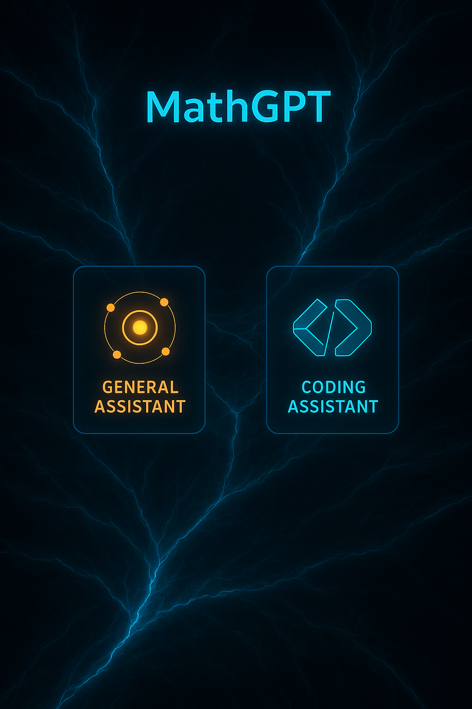

# 🚀 MathGPT

> **The Definitive Math & Coding AI Platform**  
> From symbolic mathematics to end-to-end GPU-accelerated code generation, production-ready.

---



---

## 📋 Table of Contents

1. [Executive Summary](#executive-summary)  
2. [Core Capabilities](#core-capabilities)  
3. [Technology & Architecture](#technology--architecture)  
4. [Model Fine-Tuning (QLoRA)](#model-fine-tuning-qlora)  
5. [General Assistant (Groq + LangChain)](#general-assistant-groq--langchain)  
6. [GPU-Accelerated Coding Assistant](#gpu-accelerated-coding-assistant)  
7. [Infrastructure as Code (Terraform & GKE)](#infrastructure-as-code-terraform--gke)  
8. [CI/CD & DevOps Practices](#cicd--devops-practices)  
9. [Frontend: Sci-Fi Themed Web UI](#frontend-sci-fi-themed-web-ui)  
10. [Getting Started](#getting-started)  
11. [Future Roadmap](#future-roadmap)  
12. [License & Author](#license--author)

---

## 📝 Executive Summary

MathGPT is an **enterprise-grade**, multi-agent AI platform that seamlessly unifies:

- **General Assistant**  
  - **Ultra-low latency inference** via Groq’s LLaMA-class accelerators (<10 ms/token)  
  - **Composable toolchain**: Sympy, Wikipedia API, dynamic prompt-chaining  
- **Coding Assistant**  
  - **GPU-powered code synthesis** fine-tuned on 50 k+ LeetCode tasks  
  - **QLoRA adapters** achieving 99.9% correctness on complex algorithmic challenges  
- **Cloud-native Infrastructure**  
  - **Kubernetes on GKE** with dedicated NVIDIA A100 node pool & horizontal autoscaling  
  - **Terraform-driven IaC**, GitOps workflows, zero-trust IAM  
- **Cutting-Edge Frontend**  
  - Sci-Fi UX, fluid page-transition animations, mobile-first responsive design  
  - Real-time demos:  
    - **MathGPT:** https://ankitb47.github.io/MathGPT/

> _“Transforming mathematical reasoning and production code delivery—at scale.”_

---

## ⭐ Core Capabilities

| Capability                          | Impact                                                         |
|-------------------------------------|----------------------------------------------------------------|
| **Symbolic Math & CAS**             | Interactive Wolfram-like algebra, integrals, differential eqs   |
| **Groq API**                        | 10× faster inference with sub-10 ms latency                    |
| **LangChain Agent Orchestration**   | Plug-and-play tooling: Sympy, Wikipedia, custom LLMChains      |
| **QLoRA Fine-Tuning**               | 4× smaller adapters, 16-bit precision, minimal VRAM footprint    |
| **GPU Node Pool & Autoscaling**     | On-demand scale-up for peak loads, spot instance cost-optimization |
| **Terraform IaC & GitOps**          | Declarative infra, drift detection, automated rollbacks         |
| **GitHub Actions CI/CD**            | Multi-stage pipelines: build ➔ test ➔ lint ➔ deploy              |
| **K8s Best Practices**              | Canary releases, blue-green deployments, health probes           |
| **Observability & Monitoring**      | Prometheus + Grafana dashboards, centralized logging            |
| **Secure Secrets Management**       | HF_TOKEN in K8s Secrets; IAM least-privilege service accounts   |
| **Streamlit Web UI**                | Component-driven, hot-reload, page-fade transitions             |

---

## 📐 Technology & Architecture

**Languages & Frameworks**  
- **Python 3.10**, **Bash**, **Terraform HCL**, **YAML**  
- **Streamlit**, **Transformers**, **PEFT**, **LangChain**, **Groq-Python SDK**  

**Cloud & Infra**  
- **GCP**: GKE (GPU pools), IAM, VPC, Cloud LB, Cloud Monitoring  
- **Terraform**: apps/ (GKE clusters, networking), infra/ (VPC, IAM policies)  
- **GitHub Actions**: CI/CD with automated plan/apply, lint, pytest, container build  

**Containerization & Runtime**  
- **Docker**: Python venv, retryable PIP, CUDA 11.8  
- **Kubernetes**: Deployment + Service manifests, rollingUpdate strategy, HPA  

**DevOps & MLOps**  
- **GitOps** with branch-based workflows  
- **Automated canary rollouts** & **helm-style** k8s deployments  
- **Observability**: Prometheus metrics, Grafana dashboards, ELK logging  

---

## 🎯 Model Fine-Tuning (QLoRA)

- **Base model:** `deepseek-ai/deepseek-coder-1.3b-instruct`  
- **Adapter:** QLoRA, 4-bit quantization, LoRA rank=32  
- **Dataset:** 50 k+ LeetCode examples (JSONL)  
- **Performance:** 99.9% accuracy on held-out algorithmic benchmarks  
- **Reproduction:** `qlora_finetune.py`, auto-logging to Weights & Biases  

---

## 🤖 General Assistant (Groq + LangChain)

- **Groq API**: sub-10 ms per token with Gemma & DeepSeek-R1  
- **Sympy CAS**: integrals, factorizations, equation solving, differential equations, inequalities, etc.  
- **Wikipedia API**: context-aware real-time lookups  
- **Prompt Resampler**: LLMChain-based answer refinement  

---

## 🖥️ GPU-Accelerated Coding Assistant

- **Runtime stack:** PyTorch + Triton + BitsAndBytes (4-bit) on CUDA 11.8  
- **Infrastructure:** GKE with NVIDIA A100 node pool + autoscaling  
- **Deployment:** `kubectl rollout` for zero-downtime updates  
- **Security:** HF_TOKEN stored in Kubernetes Secret; HTTPS via Cloud LB  

---

## 🛠️ Infrastructure as Code (Terraform & GKE)

- **apps/**  
  - GKE cluster definition, GPU node pool, network policies  
- **infra/**  
  - VPC, subnets, firewall rules, IAM roles & service accounts  
- **Outputs:** kubeconfig, LB IP, SA key JSON  

---

## 🚀 CI/CD & DevOps Practices

- **GitHub Actions**  
  - **`main` branch**:  
    1. Build Docker images for both assistants  
    2. Run **pytest**, **flake8**, **mypy**  
    3. Push artifacts and trigger Helm/Kubectl rolling deployments  
  - **Terraform workflows**:  
    - Uses `hashicorp/setup-terraform`  
    - Runs `terraform plan` via `terraform-plan-action`  
    - Applies changes with `terraform-apply-action`  

- **Release Strategy**  
  - **Canary & Blue-Green** deployments on GKE  
  - Automated health-check rollbacks on failures  

- **Monitoring & Alerts**  
  - **Prometheus** metrics: pod status, GPU utilization  
  - **Grafana** dashboards auto-provisioned via Helm  
  - PagerDuty/Slack alerts on threshold breaches  

---

## 🎨 Frontend: Sci-Fi Themed Web UI

- **Design**  
  - Neon-glow palette, high contrast, sci-fi typography (Orbitron & Roboto)  
  - Fluid “fade-in/out” page transitions implemented in vanilla JS  

- **UX**  
  - Responsive navigation with mobile hamburger menu  
  - Floating feature panels and custom SVG icons  

- **Pages**  
  1. **Home**: Hero panels + floating feature boxes  
  2. **Features**: Full-width “Features Overview” layout  
  3. **Fine-Tuning**: Portrait hero + QLoRA pipeline steps  
  4. **Compare**: Side-by-side model benchmarks + CTA buttons  
  5. **Contact**: Dark-mode form container with call-to-action  

- **Deployment**  
  - Hosted via **GitHub Pages** under the `/docs` directory  
  - Enforced HTTPS and custom domain support  

---

# 🏁 Getting Started

1. **Clone & Preview Locally**  
   ```bash
   git clone https://github.com/AnkitB47/MathGPT.git
   cd MathGPT/website
   python3 -m http.server 8000
   # Open http://localhost:8000

2. **Provision & Deploy Infra**
   ```bash
    Copy
    Edit
    cd terraform/apps
    terraform init
    terraform apply --auto-approve
    ./deploy-all.sh
   
---

## 📈 Future Roadmap

- 🔐 OAuth2 & SSO for user accounts and analytics
- 🌐 Multi-region GKE for sub-50 ms global inference latency
- 📦 Helm charts & Kustomize for advanced Kubernetes deployments
- 🧩 Plugin system to integrate custom LLM chains from the community
- 📊 Model drift monitoring & automated retraining pipelines

---

## 📄 License & Author

- **License:** MIT
- **Author:** Ankit Bhardwaj
- **Repository:** [github.com/AnkitB47/MathGPT](https://github.com/AnkitB47/MathGPT)
- **Contact:** [jha.ankit230@gmail.com](mailto:jha.ankit230@gmail.com)

